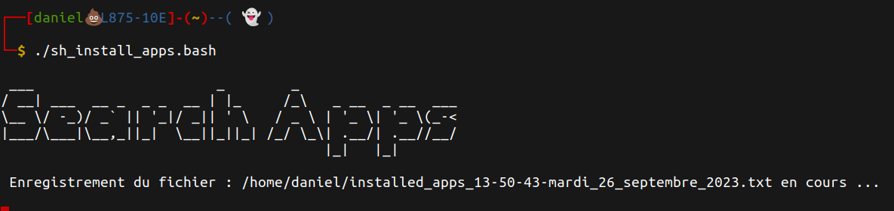

# show_installed_apps
## Usage
./sh_install_apps.bash

## Description
Ce script permet de récupérer des informations sur les paquets et les applications installées sur un système.

## Fonctionnement
- Affiche la date.
- Affiche certaines informations sur la machine.
- Liste des paquets installés et description en utilisant la commande dpkg.
- Liste les applications du système (applications qui sont dans le $PATH) et affiche une brève description.
- Liste les applications flatpak et affiche une brève description.
- Liste les applications snap et affiche une brève description.
- Liste les applications installées par  et affiche une brève description.

- Un document sera créé à la fin de la récupération de toutes ces données, ce document est horodaté et sera enregistré dans le dossier dans lequel le script a été lancé.
- Ce script est uniquement compatible avec les distributions de la famille Debian.

## Capture d'écran

